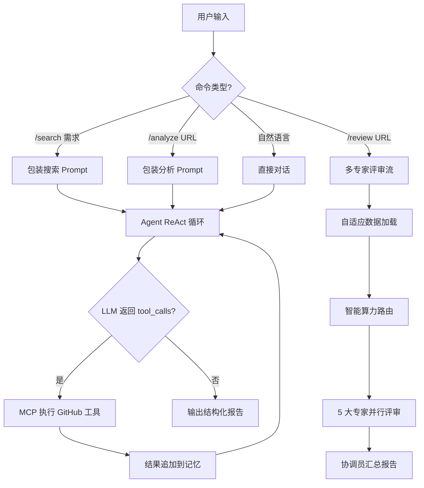

# 🚀 OpenClaw GitHub Agent

基于 MCP 协议的**混合算力多专家** GitHub 开源项目检索与分析工具。通过 AI 多轮对话，自动搜索、深度分析、并发专家评审 GitHub 项目。

## ✨ 核心功能

- **🔍 需求检索**：描述技术需求，Agent 自动搜索 GitHub、读取 README、按匹配度 1-10 分排序
- **📊 精准分析**：提供仓库 URL，深度分析项目架构、源码、优缺点和适用场景
- **🚀 多专家评审**：采用混合算力架构（Cloud + Local），5 大专家（架构/安全/UX/DevOps/生命力）并行深度联合审计
- **💬 多轮对话**：持续对话，逐步细化搜索条件或追问项目细节
- **🧠 独立记忆管理**：每个 Agent 拥有独立持久化记忆，支持精准清理与全量重置

## 核心架构



### 三种工作模式

| 模式 | 命令 | 流程 |
|------|------|------|
| **需求检索** | `/search` | 解析需求 → 搜索仓库 → 读取 README → 打分排序 → 匹配报告 |
| **精准分析** | `/analyze` | 解析 URL → 读取概览 → 分析目录 → 深入源码 → 分析报告 |
| **专家评审** | `/review` | 数据加载 → 算力路由 → 专家并行审计 → 协调员汇总 |

---

## 快速开始

### 1. 安装依赖

```bash
pip install -r requirements.txt
```

仅需 4 个核心依赖：`mcp[cli]`、`openai`、`python-dotenv`、`prompt_toolkit`。

### 2. 配置环境

```bash
cp .env.example .env
```

编辑 `.env` 文件，至少配置一个 LLM 的 API Key 和 GitHub Token。

### 3. 运行

```bash
python main.py
# 或使用快捷启动脚本
./run-agent.bat
```

---

## 配置说明

所有配置通过 `.env` 文件管理，分为三个部分：

### 1. 混合大模型配置 (LLM)

Agent 采用云端+本地混合架构。您可以根据成本和隐私需求自由调节算力分配。

| 变量前缀 | 推荐模型 | 用途 |
|----------|----------|------|
| `CLOUD_LLM_` | DeepSeek-Chat, GPT-4o | 架构审计、安全合规、协调汇总等高难度任务 |
| `LOCAL_LLM_` | Ollama GLM-PureGPU, Qwen2.5 | 数据脱水、UX 评审、项目生命力评估 |

**多模型切换参考：**

| 模型类型 | `API_KEY` | `BASE_URL` | `MODEL` |
|----------|-----------|------------|---------|
| **DeepSeek (推荐云端)** | 你的 Key | `https://api.deepseek.com/v1` | `deepseek-chat` |
| **Ollama (推荐本地)** | `ollama` | `http://localhost:11434/v1` | `GLM-PureGPU` |
| **Kimi (长文本)** | 你的 Key | `https://api.moonshot.cn/v1` | `moonshot-v1-128k` |

> **提示**：当云端模型不可用时，系统会自动触发 **平滑降级**，将任务回退给本地模型执行，确保评审永不断线。

### 2. MCP 服务端配置

控制 Agent 连接的 MCP 工具服务。默认连接 GitHub 官方 MCP Server：

| 变量 | 说明 | 默认值 |
|------|------|--------|
| `MCP_COMMAND` | MCP 服务启动命令 | `npx` |
| `MCP_ARGS` | 命令参数（逗号分隔） | `-y,@modelcontextprotocol/server-github` |
| `MCP_ENV` | 服务端环境变量 | `GITHUB_PERSONAL_ACCESS_TOKEN=ghp_xxx` |

#### GitHub Token 权限方案

在 [GitHub Settings](https://github.com/settings/tokens) 创建 Token (classic) 时勾选：

- **`repo` (全选)**：读取公开/私有库源码、列出目录、操作 Issue/PR
- **`read:org`**：读取组织信息
- **`workflow`**：审计 CI/CD 流水线（推荐）

将 Token 填入 `.env` 中的 `MCP_ENV=GITHUB_PERSONAL_ACCESS_TOKEN=ghp_xxx`。

### 3. Agent 运行配置

| 变量 | 说明 | 可选值 |
|------|------|--------|
| `AGENT_MODE` | 专家评审调度策略 | `AUTO`（推荐）/ `TURBO` / `SEQUENTIAL` |

- **AUTO**：智能路由，自动分配云端/本地算力
- **TURBO**：全部使用云端算力（最快，费用最高）
- **SEQUENTIAL**：串行执行（适合本地模型资源有限时）

---

## 使用方式

| 命令 | 说明 | 示例 |
|------|------|------|
| `/search <需求>` | 搜索匹配项目并排序 | `/search 轻量级 Python WAF` |
| `/analyze <URL>` | 精准分析指定仓库 | `/analyze https://github.com/fastapi/fastapi` |
| `/review <URL>` | 混合专家团联合深度审计 | `/review https://github.com/owner/repo` |
| 直接输入 | 自然语言对话 | `帮我对比上面 Top 3 的项目` |
| `/clear` | 清除主对话记忆 | |
| `/clear <agent>` | 清除指定专家记忆 | `/clear Security_Expert` |
| `/clear all` | 全量清除所有记忆文件 | |
| `/tools` | 查看可用 MCP 工具 | |
| `/help` | 显示帮助 | |
| `/quit` | 退出并保存 | |

> **Tab 补全**：输入 `/` 后按 Tab 可快速补全命令；输入 `/clear ` 后按 Tab 可查看所有专家名称及描述。

---

## 专家评审团

`/review` 命令会触发以下 5 位 AI 专家并行评审：

| 专家 | 算力层级 | 职责 |
|------|----------|------|
| **UX_Expert** | LOCAL | 开发者体验（DX）、文档质量、快速上手 |
| **DevOps_Expert** | LOCAL | 工程化程度、容器化、CI/CD、部署复杂度 |
| **Security_Expert** | PREMIUM | 硬编码风险、注入漏洞、合规性、供应链安全 |
| **Liveliness_Expert** | LOCAL | 社区活跃度、更新频率、生态健康 |
| **Arch_Expert** | LONG_CONTEXT | 架构设计、代码质量、可扩展性、技术选型 |

---

## 项目结构

| 文件/目录 | 用途 |
|-----------|------|
| `memories/` | 专家独立记忆存储目录（已加入 .gitignore） |
| `config.py` | 配置管理（从 `.env` 加载） |
| `prompts.py` | 多专家 Prompt 注册表 |
| `mcp_agent.py` | 核心 Agent（混合引擎 + 独立记忆 + ReAct 循环） |
| `main.py` | CLI 入口（快捷命令 + Tab 补全） |
| `tool_converter.py` | MCP → OpenAI 工具格式转换 |
| `requirements.txt` | 依赖声明 |
| `.env.example` | 环境变量模板 |

---

## License

MIT
