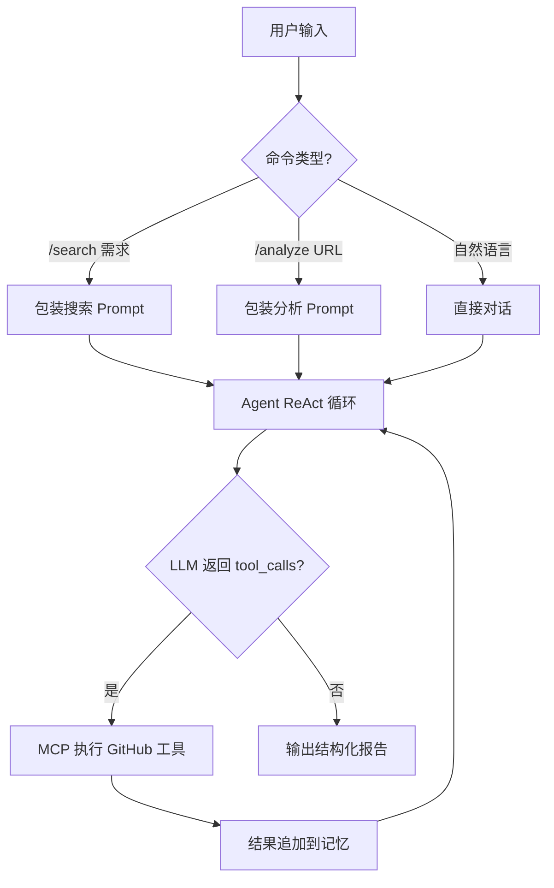

# GitHub 检索分析 Agent

基于 MCP 协议的极简 GitHub 开源项目检索与分析工具。通过 AI 多轮对话，自动搜索匹配开源项目并分析项目结构，核心代码约 **200 行**。

## 核心功能

- **🔍 需求检索**：描述技术需求，Agent 自动搜索 GitHub、读取 README、按匹配度 1-10 分排序
- **📊 精准分析**：提供仓库 URL，深度分析项目架构、源码、优缺点和适用场景
- **💬 多轮对话**：持续对话，逐步细化搜索条件或追问项目细节
- **💾 记忆持久化**：退出自动保存对话历史到 JSON 文件，下次启动自动恢复

## 核心工作流



### 两种工作模式

1. **需求检索** (`/search`)：解析需求 → 搜索仓库 → 读取 README → 打分排序 → 输出匹配报告
2. **精准分析** (`/analyze`)：解析 URL → 读取概览 → 分析目录结构 → 深入源码 → 输出分析报告

---

## 快速开始

### 1. 安装依赖

```bash
pip install -r requirements.txt
```

仅需 3 个核心依赖：`mcp[cli]`（MCP 官方 SDK）、`openai`（LLM 调用）、`python-dotenv`（配置加载）。

### 2. 配置环境

```bash
cp .env.example .env
```

编辑 `.env` 文件，需要配置以下内容：

### 3. 运行

```bash
python main.py
```

---

## 配置说明

所有配置通过 `.env` 文件管理，分为三个部分：

### LLM 模型配置

控制 Agent 使用的大语言模型。只需修改三个变量即可切换模型：

| 变量 | 说明 | 示例 |
|------|------|------|
| `LLM_API_KEY` | 模型 API 密钥 | `sk-your-key` |
| `LLM_BASE_URL` | 模型 API 地址 | `https://api.deepseek.com` |
| `LLM_MODEL` | 模型名称 | `deepseek-chat` |

**多模型切换参考：**

| 模型 | `LLM_API_KEY` | `LLM_BASE_URL` | `LLM_MODEL` |
|------|---------------|----------------|-------------|
| DeepSeek | 你的 DeepSeek Key | `https://api.deepseek.com` | `deepseek-chat` |
| OpenAI | 你的 OpenAI Key | `https://api.openai.com/v1` | `gpt-4o` |
| Ollama (本地) | `ollama`（任意值） | `http://localhost:11434/v1` | 你加载的模型名 |
| LM Studio (本地) | `lm-studio`（任意值） | `http://localhost:1234/v1` | 当前加载的模型 |

> **提示**：本地模型（Ollama / LM Studio）的 API Key 可以填任意值，不会被校验。使用本地模型时建议在代码中设置 `temperature=0`，以保证工具调用 JSON 格式的稳定性。

### MCP 服务端配置

控制 Agent 连接的 MCP 工具服务。默认连接 GitHub 官方 MCP Server：

| 变量 | 说明 | 默认值 |
|------|------|--------|
| `MCP_COMMAND` | MCP 服务启动命令 | `npx` |
| `MCP_ARGS` | 命令参数（逗号分隔） | `-y,@modelcontextprotocol/server-github` |
| `MCP_ENV` | 服务端环境变量（逗号分隔 KEY=VALUE） | `GITHUB_PERSONAL_ACCESS_TOKEN=ghp_xxx` |

**GitHub Token 获取方式：**
1. 访问 [GitHub Settings → Developer settings → Personal access tokens](https://github.com/settings/tokens)
2. 创建一个 Token，勾选 `repo`（读取仓库）和 `read:org`（读取组织信息）权限
3. 将 Token 填入 `MCP_ENV` 中的 `GITHUB_PERSONAL_ACCESS_TOKEN`

**切换到其他 MCP 服务：**

```env
# 连接自定义 Python MCP Server
MCP_COMMAND=python
MCP_ARGS=path/to/your_mcp_server.py
MCP_ENV=

# 连接 OpenClaw 的 MCP 服务
MCP_COMMAND=openclaw
MCP_ARGS=mcp,serve
MCP_ENV=OPENCLAW_API_KEY=your_key
```

### Agent 配置

| 变量 | 说明 | 默认值 |
|------|------|--------|
| `MEMORY_FILE` | 对话历史持久化路径，留空则不保存 | `memory.json` |

---

## 使用方式

| 命令 | 说明 | 示例 |
|------|------|------|
| `/search <需求>` | 搜索匹配项目并排序 | `/search 轻量级 Python WAF` |
| `/analyze <URL>` | 精准分析指定仓库 | `/analyze https://github.com/fastapi/fastapi` |
| 直接输入 | 自然语言对话 | `帮我对比上面 Top 3 的项目` |
| `/clear` | 清除对话记忆 | |
| `/tools` | 查看可用 MCP 工具 | |
| `/help` | 显示帮助 | |
| `/quit` | 退出并保存 | |

---

## 项目结构

| 文件 | 用途 | 核心行数 |
|------|------|----------|
| `config.py` | 配置管理（从 `.env` 加载） | ~15 行 |
| `prompts.py` | GitHub 检索分析专用 System Prompt | ~60 行 |
| `tool_converter.py` | MCP → OpenAI 工具格式转换 | ~10 行 |
| `mcp_agent.py` | 核心 Agent（ReAct 循环 + 记忆） | ~60 行 |
| `main.py` | CLI 入口（含快捷命令） | ~55 行 |
| `requirements.txt` | 依赖声明 | 3 行 |
| `.env.example` | 环境变量模板 | 配置文件 |
