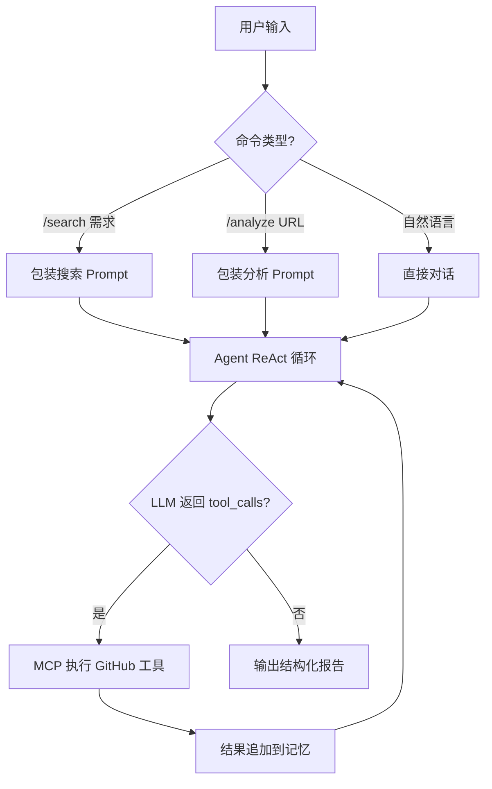

# GitHub 检索分析 Agent

基于 MCP 协议的极简 GitHub 开源项目检索与分析工具。通过 AI 多轮对话，自动搜索匹配开源项目并分析项目结构，核心代码约 **200 行**。

## 核心功能

- **🔍 需求检索**：描述技术需求，Agent 自动搜索 GitHub、读取 README、按匹配度 1-10 分排序
- **📊 精准分析**：提供仓库 URL，深度分析项目架构、源码、优缺点和适用场景
- **🚀 多专家评审**：采用混合算力架构（Cloud + Local），针对架构、安全、UX 等维度进行多专家深度联合审计
- **💬 多轮对话**：持续对话，逐步细化搜索条件或追问项目细节
- **💾 记忆持久化**：退出自动保存对话历史到 JSON 文件，下次启动自动恢复

## 核心工作流



### 两种工作模式

1. **需求检索** (`/search`)：解析需求 → 搜索仓库 → 读取 README → 打分排序 → 输出匹配报告
2. **精准分析** (`/analyze`)：解析 URL → 读取概览 → 分析目录结构 → 深入源码 → 输出分析报告
3. **多专家评审** (`/review`)：专家分工 → 智能路由（云/地） → 数据脱水 → 专家并行评审 → 协调员汇总报告

---

## 快速开始

### 1. 安装依赖

```bash
pip install -r requirements.txt
```

仅需 3 个核心依赖：`mcp[cli]`（MCP 官方 SDK）、`openai`（LLM 调用）、`python-dotenv`（配置加载）。

### 2. 配置环境

```bash
cp .env.example .env
```

编辑 `.env` 文件，需要配置以下内容：

### 3. 运行

```bash
python main.py
```

---

## 配置说明

所有配置通过 `.env` 文件管理，分为三个部分：

### 1. 混合大模型配置 (LLM)

Agent 采用云端+本地混合架构。您可以根据成本和隐私需求自由调节算力分配。

| 变量前缀 | 推荐模型 | 用途 |
|----------|----------|------|
| `CLOUD_LLM_` | DeepSeek-Chat, GPT-4o | 负责专家协调、架构审计、安全合规分析等高难度任务 |
| `LOCAL_LLM_` | Ollama GLM-PureGPU, Qwen2.5 | 负责本地数据脱水（清洗注释）、UX 评审、项目生命力评估 |

**多模型切换参考：**

| 模型类型 | `API_KEY` | `BASE_URL` | `MODEL` |
|----------|-----------|------------|---------|
| **DeepSeek (推荐云端)** | 你的 Key | `https://api.deepseek.com/v1` | `deepseek-chat` |
| **Ollama (推荐本地)** | `ollama` | `http://localhost:11434/v1` | `GLM-PureGPU` |
| **Kimi (长文本)** | 你的 Key | `https://api.moonshot.cn/v1` | `moonshot-v1-128k` |

> **提示**：当云端模型不可用时，系统会自动触发 **平滑降级**，将任务回退给本地模型执行，确保评审永不断线。

### MCP 服务端配置

控制 Agent 连接的 MCP 工具服务。默认连接 GitHub 官方 MCP Server：

| 变量 | 说明 | 默认值 |
|------|------|--------|
| `MCP_COMMAND` | MCP 服务启动命令 | `npx` |
| `MCP_ARGS` | 命令参数（逗号分隔） | `-y,@modelcontextprotocol/server-github` |
| `MCP_ENV` | 服务端环境变量（逗号分隔 KEY=VALUE） | `GITHUB_PERSONAL_ACCESS_TOKEN=ghp_xxx` |

#### GitHub Token 权限方案：
为了让 Agent 具备完整的审计能力，请在 [GitHub Settings](https://github.com/settings/tokens) 创建 Token (classic) 时至少勾选：
- **`repo` (全选)**：读取隐私/公开库源码、列出目录、操作 Issue/PR
- **`read:org`**：读取组织信息
- **`workflow`**：审计 CI/CD 流水线（推荐）

将 Token 填入 `.env` 中的 `MCP_ENV=GITHUB_PERSONAL_ACCESS_TOKEN=ghp_xxx`。

**切换到其他 MCP 服务：**

```env
# 连接自定义 Python MCP Server
MCP_COMMAND=python
MCP_ARGS=path/to/your_mcp_server.py
MCP_ENV=

# 连接 OpenClaw 的 MCP 服务
MCP_COMMAND=openclaw
MCP_ARGS=mcp,serve
MCP_ENV=OPENCLAW_API_KEY=your_key
```

### Agent 配置

| 变量 | 说明 | 默认值 |
|------|------|--------|
| `MEMORY_FILE` | 对话历史持久化路径，留空则不保存 | `memory.json` |

---

## 使用方式

| 命令 | 说明 | 示例 |
|------|------|------|
| `/search <需求>` | 搜索匹配项目并排序 | `/search 轻量级 Python WAF` |
| `/analyze <URL>` | 精准分析指定仓库 | `/analyze https://github.com/fastapi/fastapi` |
| `/review <URL>` | 混合专家团联合深度审计 | `/review https://github.com/voodooq/github-agent` |
| 直接输入 | 自然语言对话 | `帮我对比上面 Top 3 的项目` |
| `/clear [agent]` | 清除指定（或主对话）记忆 | `/clear UX_Expert` |
| `/tools` | 查看可用 MCP 工具 | |
| `/help` | 显示帮助 | |
| `/quit` | 退出并保存 | |

---

## 项目结构

| 文件/目录 | 用途 | 核心行数 |
|-----------|------|----------|
| `memories/` | **[NEW]** 专家独立记忆存储目录 | - |
| `config.py` | 配置管理（从 `.env` 加载） | ~25 行 |
| `prompts.py` | GitHub 检索分析专用的多专家 Prompt 库 | ~100 行 |
| `mcp_agent.py` | 核心 Agent（混合引擎 + 独立记忆管理） | ~340 行 |
| `main.py` | CLI 入口（含快捷命令与补全） | ~190 行 |
| `requirements.txt` | 依赖声明 | 3 行 |
| `.env.example` | 环境变量模板 | 配置文件 |
